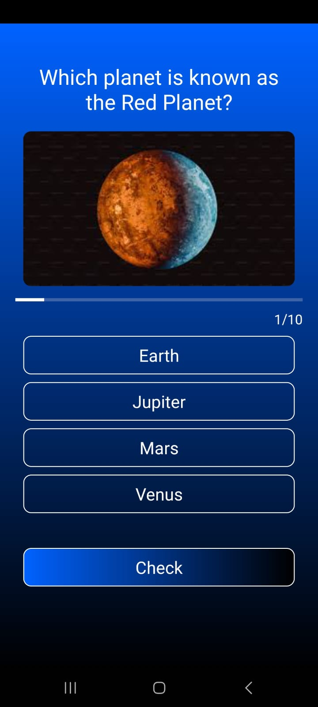
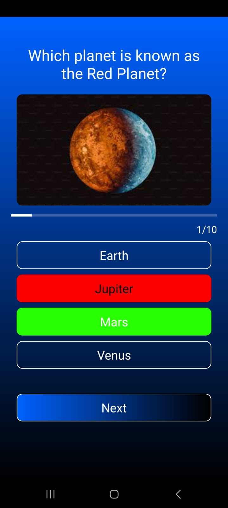

# INTRODUCTION 
## 🧠 Quiz App – Test Your Knowledge with Style
Quiz App is a sleek and interactive quiz application designed to provide users with a fun and engaging way to test their knowledge. Featuring a set of 10 thoughtfully curated questions, the app challenges users in a clean and modern interface built for smooth navigation and quick feedback.

From question navigation to result evaluation, every part of the experience is optimized for clarity, ease, and responsiveness — making it ideal for learners, educators, and trivia lovers.

## 🌟 Key Features
#### ❓ 10 Multiple Choice Questions
A fixed quiz set to evaluate knowledge on a specific topic or subject.

#### 🧭 User-Friendly Navigation
Tap through each question with a seamless flow and intuitive layout.

#### 🎨 Modern UI
Clean and visually appealing interface that works well on all screen sizes.

#### ✅ Instant Feedback Summary
At the end of the quiz, users get a complete result showing how many answers were correct and incorrect.

#### 💡 Great for Learning or Fun
Ideal for practicing concepts or just enjoying a quick trivia session.

## 📸 User Interface
### 🙋‍♂️ Start Quiz

### ❓ Quiz Questions Screen

### ✅ Answer Selection & Instant Check

### 🧾 Final Result Summary

